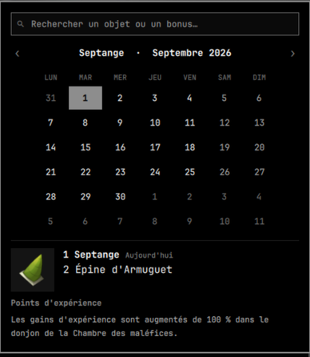
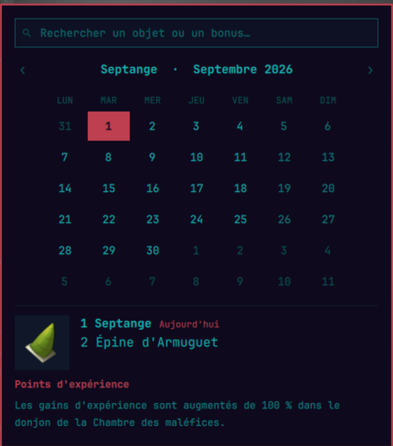
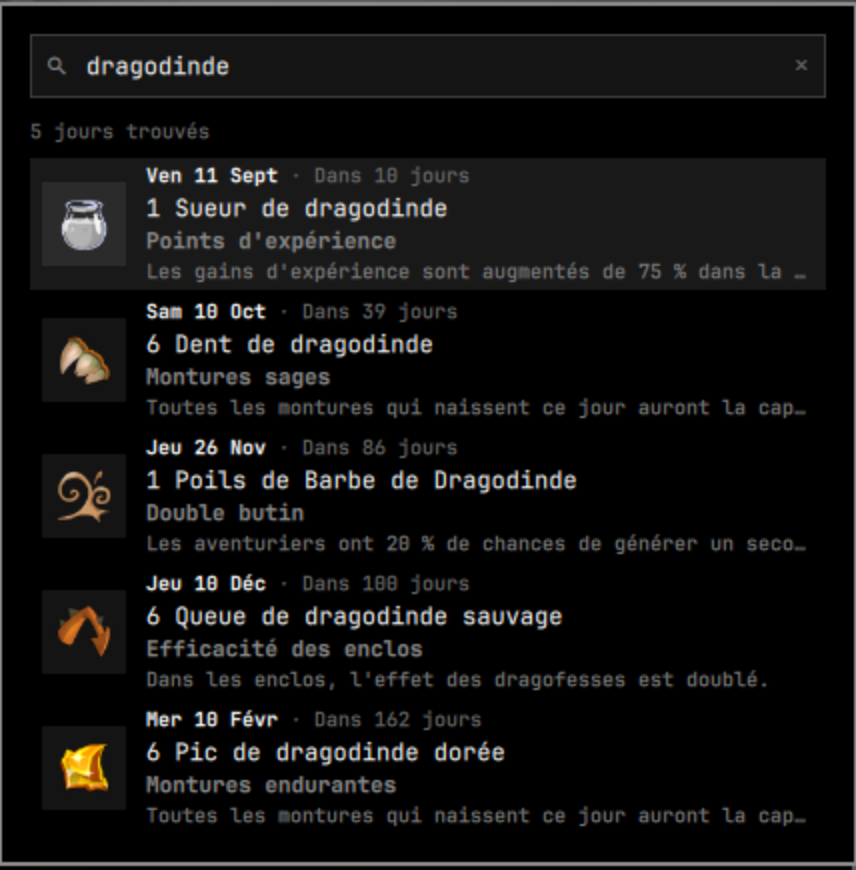

# Almanax for Omarchy

A [Dofus](https://www.dofus.com) Almanax widget for the [Omarchy](https://omarchy.org)
shell bar: today's offering in the bar, a browsable calendar popup for any
other day of the year, and a search over the whole year's offerings and bonuses.

<p align="center">
  
  
</p>

<p align="center"><sub>The same plugin under two Omarchy themes.</sub></p>

## What it does

The bar shows the current day's offering. Clicking it opens a calendar panel
built like Omarchy's own clock popup:

- month grid with the Dofus month name alongside the Gregorian one
  (`Fraouctor · Août 2026`)
- today outlined, the day you are looking at filled
- a detail card with the offering artwork, the offering, the bonus name and
  its full description
- a relative label, so a browsed day says `Dans 3 jours` rather than leaving
  you to count squares
- a search field above the grid, for the other half of the question

It follows **Europe/Paris**, not your local timezone. The Almanax rolls over
at midnight on Ankama's clock, so anywhere west of Paris the local date is the
wrong answer for part of every day.

## Search

Browsing the calendar answers *what is on this day*. The search field answers
*which day gives me this*, which is the question you actually have when you are
deciding when to log in.



Type anything and the grid gives way to the days that match, each with its date,
how far away it is, the offering you have to hand over, and the bonus you get
for it. Pick one — `Enter` or a click — and the calendar comes back on that day,
with the full bonus description.

- **Every day is a future date.** Results are the *next* occurrence of each
  matching day, soonest first, so the top of the list is the one you can go and
  do next. The Almanax repeats on a yearly cycle, so browsing far enough forward
  always finds every match.
- **Accents and case are ignored**, in both directions: `epine` finds
  `2 Épine d'Armuguet`, and so does `ÉPINE`.
- **Several words narrow, they do not widen.** `bois abondant` lists only the
  days matching both.
- **Offerings and bonus names rank above descriptions.** A word that only turns
  up inside a paragraph of bonus text sorts below the days that are actually
  named for it.
- Broad queries list the 60 soonest matches and say how many more there are.

## Theming

There is not one hardcoded colour in this plugin. Every surface, label, border
and accent reads Omarchy's own `Color` tokens, so it repaints itself the moment
you switch themes — the search field included, since it is the shell's own text
input rather than a lookalike. The two screenshots above are the same code.

## Interactions

| Where | Input | Result |
|---|---|---|
| Bar | left click | open/close the calendar |
| Bar | right click | open the Almanax page on Dofus pour les Noobs |
| Grid | click a day | show that day's Almanax |
| Grid | scroll | previous/next month |
| Grid | `‹` `›` | previous/next month |
| Panel | arrow keys | step a day (left/right) or a week (up/down) |
| Panel | `[` `]` | previous/next month |
| Panel | `t` | back to today |
| Panel | `/` | jump to the search field |
| Panel | `Esc` | close |
| Search | type | list the matching days, soonest first |
| Search | `↑` `↓` | move through the results |
| Search | `Enter` | open the highlighted day on the calendar |
| Search | click a result | open that day on the calendar |
| Search | `Esc` or `✕` | clear the search, back to the calendar |

Reopening the panel always returns to today, with no query left over.

## Install

```bash
omarchy plugin add https://github.com/PinkPantr/omalmanax.git --enable --yes
```

Or by hand:

```bash
git clone https://github.com/PinkPantr/omalmanax.git \
  ~/.config/omarchy/plugins/pinkpantr.almanax
omarchy-shell shell rescanPlugins
omarchy plugin enable pinkpantr.almanax right
```

Move it with `omarchy bar move pinkpantr.almanax center`.

Requires Omarchy 4 (the Quickshell-based shell) and Python 3.9+, both of which
a stock Omarchy install already has.

## Settings

Set these on the widget's entry in `~/.config/omarchy/shell.json`:

```json
{ "id": "pinkpantr.almanax", "showOffering": false }
```

| Key | Default | Effect |
|---|---|---|
| `showOffering` | `true` | `true` shows the offering in the bar, `false` shows the bonus name |
| `weekStartDay` | `1` (Monday) | 0 = Sunday … 6 = Saturday. Also in the widget's settings screen |

## How the data works

`almanax-sync` downloads the dataset behind the Dofus pour les Noobs / Dimtopia
Almanax widget and caches it under `~/.cache/almanax/`:

- `data.json` — all 366 days
- `img/` — the offering artwork, ~1.6 MB for the full year

Entries are keyed by Dofus date (`31 Fraouctor`) with no year, because the
Almanax repeats on the same yearly cycle. That is what lets the panel step to
any date, forward or back, with no further network access — **once synced, the
whole thing works offline.**

The widget runs the sync itself on shell start and again at each Paris
midnight. Only artwork that is missing gets downloaded, so a re-sync is cheap. If a sync fails (offline at boot, say), it tries again every 5 minutes until it works.
`data.json` is written atomically, so the panel never reads a half-written
file. You can force a sync with:

```bash
omarchy-shell pinkpantr.almanax sync
```

## IPC

```bash
omarchy-shell pinkpantr.almanax open      # or close / toggle / show / hide
omarchy-shell pinkpantr.almanax refresh   # re-read the Paris clock
omarchy-shell pinkpantr.almanax sync      # re-download the dataset
```

Handy for a Hyprland bind:

```
bindd = SUPER, A, Almanax, exec, omarchy-shell pinkpantr.almanax toggle
```

## Language

The interface is French, because the data source is. Month names, weekday
names and the relative labels all follow it.

## Credits

The Almanax data and offering artwork come from the widget published by
**[Dofus pour les Noobs](https://www.dofuspourlesnoobs.com/calendrier-de-lalmanax.html)**
and **[Dimtopia](https://www.dimtopia.com)**. This plugin reads their public
widget data and does not redistribute it — nothing is vendored into this repo,
and every asset is fetched by the user's own machine at runtime. All credit for
compiling and maintaining the Almanax dataset is theirs. If you find this
useful, go and use their site.

DOFUS and ANKAMA are trademarks of Ankama. This is an unofficial fan project,
not affiliated with or endorsed by Ankama, Dofus pour les Noobs, or Dimtopia.

## License

MIT, for this plugin's own source. See [LICENSE](LICENSE) — it does not cover
the third-party data or artwork described above.
