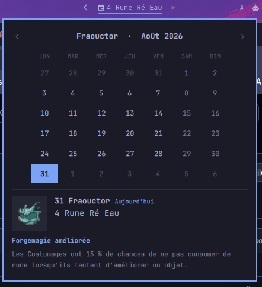

# Almanax for Omarchy

A [Dofus](https://www.dofus.com) Almanax widget for the [Omarchy](https://omarchy.org)
shell bar: today's offering in the bar, and a browsable calendar popup for any
other day of the year.



## What it does

The bar shows the current day's offering. Clicking it opens a calendar panel
built like Omarchy's own clock popup:

- month grid with the Dofus month name alongside the Gregorian one
  (`Fraouctor · Août 2026`)
- today outlined, the day you are looking at filled
- a detail card with the offering artwork, the offering, the bonus name and
  its full description
- a relative label, so a browsed day says `Dans 3 jours` rather than leaving
  you to count squares

It follows **Europe/Paris**, not your local timezone. The Almanax rolls over
at midnight on Ankama's clock, so anywhere west of Paris the local date is the
wrong answer for part of every day.

## Interactions

| Where | Input | Result |
|---|---|---|
| Bar | left click | open/close the calendar |
| Bar | right click | open the Almanax page on Dofus pour les Noobs |
| Grid | click a day | show that day's Almanax |
| Grid | scroll | previous/next month |
| Grid | `‹` `›` | previous/next month |
| Panel | arrow keys | step a day (left/right) or a week (up/down) |
| Panel | `[` `]` | previous/next month |
| Panel | `t` | back to today |
| Panel | `Esc` | close |

Reopening the panel always returns to today.

## Install

```bash
omarchy plugin add https://github.com/<you>/omarchy-almanax.git --enable --yes
```

Or by hand:

```bash
git clone https://github.com/<you>/omarchy-almanax.git \
  ~/.config/omarchy/plugins/pinkpantr.almanax
omarchy-shell shell rescanPlugins
omarchy plugin enable pinkpantr.almanax right
```

Move it with `omarchy bar move pinkpantr.almanax center`.

Requires Omarchy 4 (the Quickshell-based shell) and Python 3.9+, both of which
a stock Omarchy install already has.

## Settings

Set these on the widget's entry in `~/.config/omarchy/shell.json`:

```json
{ "id": "pinkpantr.almanax", "showOffering": false }
```

| Key | Default | Effect |
|---|---|---|
| `showOffering` | `true` | `true` shows the offering in the bar, `false` shows the bonus name |
| `weekStartDay` | `1` (Monday) | 0 = Sunday … 6 = Saturday |

## How the data works

`almanax-sync` downloads the dataset behind the Dofus pour les Noobs / Dimtopia
Almanax widget and caches it under `~/.cache/almanax/`:

- `data.json` — all 366 days
- `img/` — the offering artwork, ~1.7 MB for the full year

Entries are keyed by Dofus date (`31 Fraouctor`) with no year, because the
Almanax repeats on the same yearly cycle. That is what lets the panel step to
any date, forward or back, with no further network access — **once synced, the
whole thing works offline.**

The widget runs the sync itself on shell start and again at each Paris
midnight. Only artwork that is missing gets downloaded, so a re-sync is cheap.
`data.json` is written atomically, so the panel never reads a half-written
file. You can force a sync with:

```bash
omarchy-shell pinkpantr.almanax sync
```

## IPC

```bash
omarchy-shell pinkpantr.almanax open      # or close / toggle / show / hide
omarchy-shell pinkpantr.almanax refresh   # re-read the Paris clock
omarchy-shell pinkpantr.almanax sync      # re-download the dataset
```

Handy for a Hyprland bind:

```
bindd = SUPER, A, Almanax, exec, omarchy-shell pinkpantr.almanax toggle
```

## Language

The interface is French, because the data source is. Month names, weekday
names and the relative labels all follow it.

## Credits

The Almanax data and offering artwork come from the widget published by
**[Dofus pour les Noobs](https://www.dofuspourlesnoobs.com/calendrier-de-lalmanax.html)**
and **[Dimtopia](https://www.dimtopia.com)**. This plugin reads their public
widget data and does not redistribute it — nothing is vendored into this repo,
and every asset is fetched by the user's own machine at runtime. All credit for
compiling and maintaining the Almanax dataset is theirs. If you find this
useful, go and use their site.

DOFUS and ANKAMA are trademarks of Ankama. This is an unofficial fan project,
not affiliated with or endorsed by Ankama, Dofus pour les Noobs, or Dimtopia.

## License

MIT, for this plugin's own source. See [LICENSE](LICENSE) — it does not cover
the third-party data or artwork described above.
